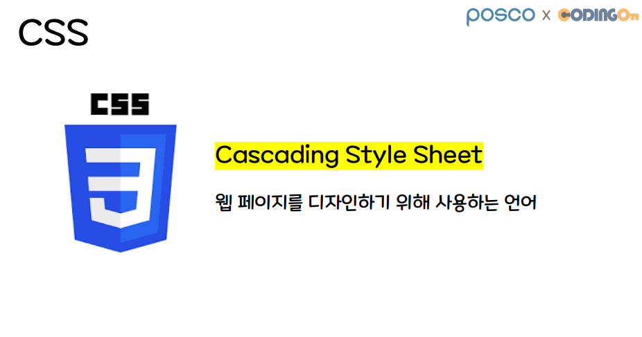
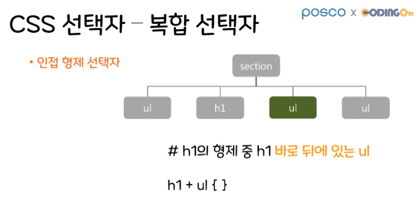

# 09/23 CSS

Section: KDT 3rd
작성일시: 2022년 9월 23일 오전 9:21
최종 편집일시: 2022년 9월 23일 오후 12:10

- 웹 페이지 디자인을 위해 사용되는 툴.
- cascading-system으로 인해 위에서 밑으로 적용

## CSS 참조 방식

### 외부 스타일 시트(External Style Sheet)

- css 확장자를 가진 스타일 시트 파일을 생성
- HTML 문서에 연결해 사용
- @import를 통해 사용

### 내부 스타일 시트(Internal Style Sheet)

- HTML 문서 내에서 <head>태그 내부에 <style> 태그를 이용해 css를 정의하는 방식

### HTML 태그 내의 스타일 지정(Inline Styles)

- HTML 태그 안에 styles 속성을 이용해 정의하는 방법

# CSS 선택자

# 복잡한 속성

# FLEX

### flex-direction: 정렬 방향 (주축 방향)

- row (default): 수평 정렬 (좌 -> 우) `[default]`
- row-reverse: 수평 정렬 (우 -> 좌)
- column: 수직 정렬 (위 -> 아래)
- column-reverse: 수직 정렬 (아래 -> 위)

### justify-content: 주축 item을 어떻게 배치할 것인가?

- flex-direction: 수평 정렬일 때; 주축 = row
- flex-direction: 수직 정렬일 때; 주축 = column

### justify-content 명령어

- flex-start (default): 아이템을 start 지점을 기준으로 나열
- flex-end: 아이템을 end 지점을 기준으로 나열
- space-between: 처음과 마지막 아이템을 양 끝에 붙이고, 나머지 영역 공평하게 나눔
- space-around: 아이템들이 모든 여백을 공평하게 나눔 (양끝 영역 1, 나머지 영역 2)
- space-evenly: start부터 첫 아이템의 간격, 아이템 끼리의 간격, 마지막 아이템부터 end까지의 간격이 일정

### align-items: 교차축 item을 어떻게 배치할 것인가?

- align-items: center;
- align-items: stretch; item들을 부모태그 크기로 늘려줌
- align-items: start;
- align-items: end;

## flex-wrap

`flex-item` 요소들이 강제로 한줄에 배치되게 할 것인지, 또는 가능한 영역 내에서 벗어나지 않고 여러행으로 나누어 표현 할 것인지 결정하는 속성입니다. 만약 영역 내에서 벗어나지 못하게 설정한다면, 동시에 요소의 방향 축을 결정할 수 있습니다.

- `flex-wrap: nowrap;`
- `flex-wrap: wrap;`
- `flex-wrap: wrap-reverse;`

### align-content

`flex-wrap` 속성의 값이 `wrap`인 경우 아이템들의 가로폭의 합이 콘테이너의 가로폭을 넘어가면 아이템이 다음 줄로 내려갑니다. 이때 여러 줄이 되어버린 아이템들의 정렬을 어떻게 할지 정하는 속성이 align-content입니다.

default는 `stretch`로, 높이를 꽉 채웁니다.

- align-content: flex-start;
- align-content: flex-end;
- align-content: center;
- align-content: space-between;
- align-content: space-around;

---

`Inspect` 창에서 `Styles` 탭으로 정해진 `css`요소들을 껐다켰다 할 수 있는 놀라운 방법이 있었다.

`flex-direction: row` 는 `default`이다.
