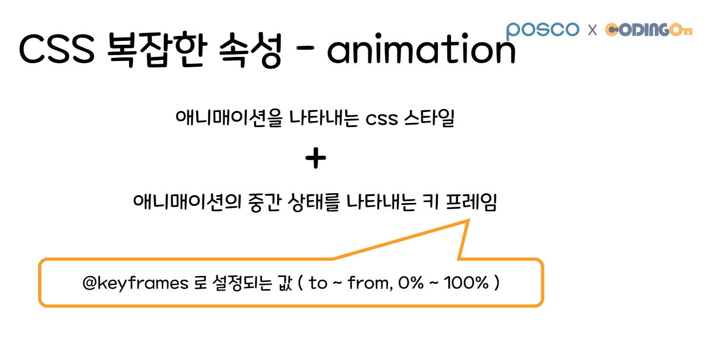
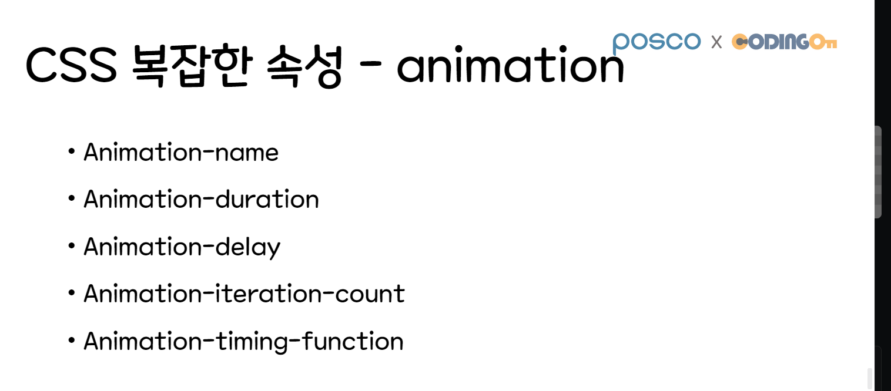
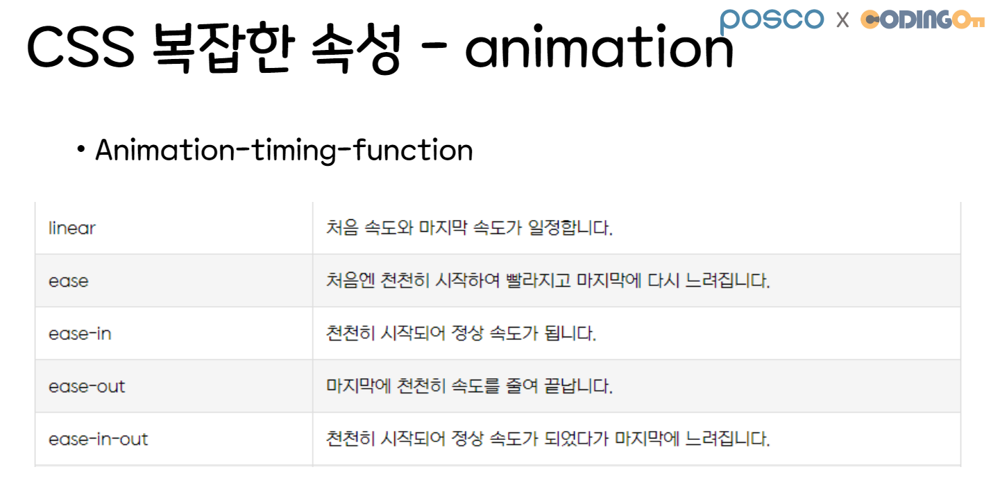

# 09/26 Animation

Section: KDT 3rd
작성일시: 2022년 9월 26일 오전 9:11
최종 편집일시: 2022년 9월 26일 오후 9:15

## transition

프로퍼티(= 속성) 값 변경시, 일정 시간에 걸쳐 변화가 일어나도록 함.

- transition-property: 변화 대상인 css 속성을 지정 (default: all)
- transition-duration: 변화가 일어난 시간 지정 (단위: s, ms)
- transition-timing-function: 변화 시간별 속도 지정
  linear, ease, ease-in, ease-out, ease-in-out
- transition-delay: 지연 시간 = 몇 초 기다렸다가 시작할건지 (단위: s, ms)

## animation 프로퍼티

- animation-name: @keyframes에 지정한 애니메이션 이름 - 시작: from or 0% - 중간: 0 ~ 100% 사이의 값 - 끝: to or 100%
- animation-duration: 애니메이션 한 사이클이 얼마동안 일어날 것인지 (단위: s, ms)
- animation-delay: 요소가 그려지고 난 후, 언제 애니메이션을 시작할지 (단위: s, ms)
- animation-interation-count: 애니메이션 반복 횟수 (default: 1)
- animation-timing-function: 중간중간 어떤 시간으로 상태를 변화시킬지 - linear, ease, ease-in, ease-out, ease-in-out
- animation-direction: 애니메이션이 끝나고 난 후, 반복될 때 진행할 방향 지정 - normal, reverse, alternate, alternate-reverse

## animation 축약형

- animation: name duration timing-function delay iteration-count direction;
- animation: bounce1 1s ease-out infinite alternate;
