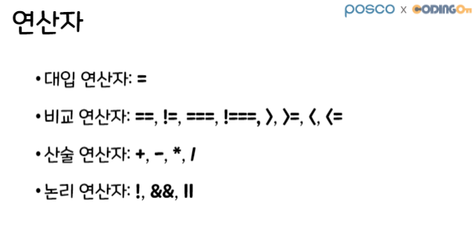
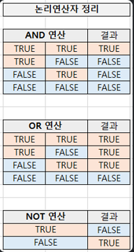
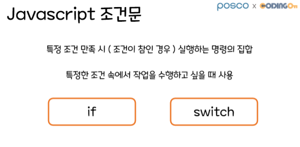
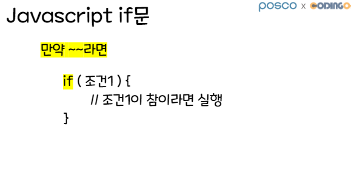
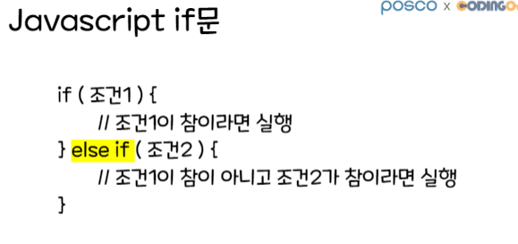
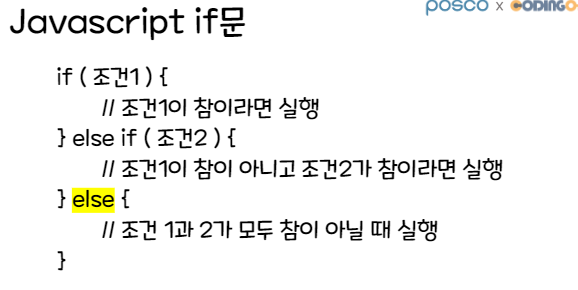
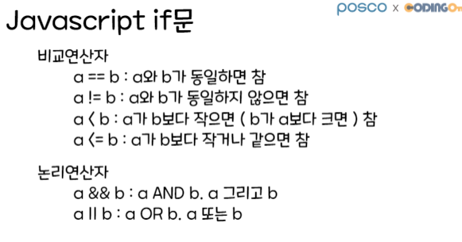
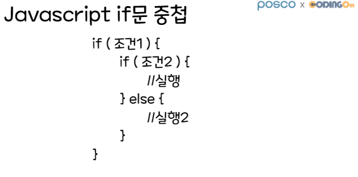

# 09/28 if - else 조건문

Section: KDT 3rd
작성일시: 2022년 9월 28일 오전 11:16
최종 편집일시: 2022년 9월 29일 오전 9:23



## 비교 연산자: ==, !=

```jsx
console.log(1 == 1); //true
console.log(1 == 2); //false
console.log(1 != 1); //false
console.log(1 != 2); //true
```

## 비교 연산자 >, <, >=, <=

```jsx
console.log("---");
console.log(2 > 1); // true
console.log(2 < 1); // false
console.log(1 >= 1); // true
console.log(1 <= 1); // true
```

## 논리 연산자

- `&&`: and (둘 다 참이어야 참)
- `||`: or (둘 중 하나라도 참이면 참)
- `!`: not (참 -> 거짓, 거짓 -> 참)

```jsx
console.log("---");
console.log(true && true); // true
console.log(true && false); // false
console.log(false && true); // false
console.log(false && false); // false
console.log(true || true); // true
console.log(true || false); // true
console.log(false || true); // true
console.log(false || false); // false
console.log(!true); // false
console.log(!false); // true
console.log(!!false); // false
```



## 동등 연산자: ==, !=, ===, !==

```jsx
console.log(1 == 1); // true
console.log(1 == 2); // false
console.log(1 != 1); // false
console.log(1 != 2); // true
console.log("1" == 1); // true
console.log("2" != 1); // true
// ==, !=: 타입(자료형)이 달라도 괜찮음! 값만 비교
```

```jsx
console.log(1 === 1); // true
console.log(1 === 2); // false
console.log(1 !== 1); // false
console.log(1 !== 2); // true
console.log("1" === 1); // false
console.log("2" !== 1); // true
```

## 함수 안에서 조건문을 사용한다면?

```jsx
function isBig() {
  if (5 > 3) {
    return "bigger";
  }
}
console.log(isBig()); // console.log('bigger');
```













## 조건문 중첩 예시

```jsx
let usrId = "user";
let usrPw = "1234";
// 로그인할 때 입력한 아이디, 비번
let inputId = "user";
let inputPw = "1234";
// 아이디가 일치
// 		ㄴ 비밀번호 일치 -> 인사
// 		ㄴ 비밀번호 불일치 -> 불일치
if (usrId == inputId) {
  if (usrPw == inputPw) {
    console.log(`${userId}님 하이`);
  } else {
    console.log("비밀번호 재확인.");
  }
  // 아이디가 불일치 -> 불일치
} else {
  console.log("아이디 없음");
}
```

### Step1. (조건문) 홀짝을 구별하는 조건문 생성

- n 변수를 선언하고 6을 할당
- num이 짝수라면 콘솔창에 "짝수" 출력
- num이 홀수라면 콘솔창에 "홀수" 출력
- 힌트) 짝수는 2로 나누어 떨어지는 수이다. 즉, 짝수는 2로 나눈 나머지가 0과 같다.

### Step2. (함수 + if-esle 조건문) 짝수인지 판별하는 함수 `isEven()` 정의하고 호출하기

- `isEven()` 함수는 매개변수 `x` 를 가짐
  매개변수 `x`의 값이 짝수라면, `true` 반환
- 매개변수 `x`의 값이 홀수라면, `false` 반환

```jsx
function isEven() {
  // 함수 완성하기
}
console.log(isEven(8)); // true
console.log(isEven(7)); // false
```

```jsx
//step.1
const n = 6;
if (n % 2 == 0) {
    console.log("짝수");
  } else {
    console.log("홀수");
  }
}
//step.2

function isEven(x) {
  if (x % 2 == 0) {
    return true;
  } else {
    return false;
  }
}

console.log(isEven(8));
console.log(isEven(7));
```

```jsx
// ======================================
// Q. (함수 + if-else if-else 조건문) 색상을 얻는 getColor() 함수 정의하고 호출하기
// - getColor() 함수는 매개변수 sign을 가짐
// - 매개변수 sign의 값이 'go'이면, 'green'을 반환
// - 매개변수 sign의 값이 'slow'이면, 'yellow'를 반환
// - 매개변수 sign의 값이 'stop'이면, 'red'를 반환
function getColor(sign) {
  if (sign == "go") {
    return "green";
  } else if (sign == "slow") {
    return "yellow";
  } else if (sign == "stop") {
    return "red";
  }
}
console.log(getColor("go")); // green
console.log(getColor("slow")); // yellow
console.log(getColor("stop")); // red

// Q.
// - isValidate 함수는 비밀번호를 의미하는 pw1, pw2 두 개의 매개변수를 가짐
// - pw1은 길이가 5 이상이라면,
//      - pw1과 pw2가 같다면, ''비밀번호 일치~' 반환
//      - pw1과 pw2가 같지 않다면, ''비밀번호 불일치..' 반환
// - pw1의 길이가 5 미만이라면, '비밀번호는 5자리 이상!!!' 반환

function isValidate(pw1, pw2) {
  if (pw1.length >= 5) {
    if (pw1 == pw2) {
      return "비밀번호 일치~";
    } else if (pw1 != pw2) {
      return "비밀번호 불일치..";
    }
  } else if (pw1.length < 5) {
    return "비밀번호는 5자리 이상!!!";
  }
}

console.log(isValidate("1234", "1234")); //  '비밀번호는 5자리 이상!!!'
console.log(isValidate("12345", "12345")); // '비밀번호 일치~'
console.log(isValidate("12345", "12345!!")); //  '비밀번호 불일치..'

// 비밀번호 확인 조건이 추가되었습니다.
// - pw1은 길이가 5 이상이고 8이 이하라면,
//      - pw1과 pw2가 같다면, ''비밀번호 일치~' 반환
//      - pw1과 pw2가 같지 않다면, ''비밀번호 불일치..' 반환
// - pw1의 길이가 5 미만이거나 8 초과라면, '비밀번호는 5자리 이상 8자리 이하!!!' 반환
function isValidate2(pw1, pw2) {
  if (pw1.length >= 5 && pw1.length <= 8) {
    if (pw1 == pw2) {
      return "비밀번호 일치~";
    } else if (pw1 != pw2) {
      return "비밀번호 불일치..";
    }
  } else if (pw1.length < 5 || pw1.length > 8) {
    return "비밀번호는 5자리 이상 8자리 이하!!!";
  }
  // 함수 내부 채워주세요.
}

console.log(isValidate2("1234", "1234")); // '비밀번호는 5~8자리만 가능!!!'
console.log(isValidate2("123456789", "123456789")); // '비밀번호는 5~8자리만 가능!!!'
console.log(isValidate2("12345", "12345")); // '비밀번호 일치~'
console.log(isValidate2("12345", "12345!!")); // '비밀번호 불일치..'
```
