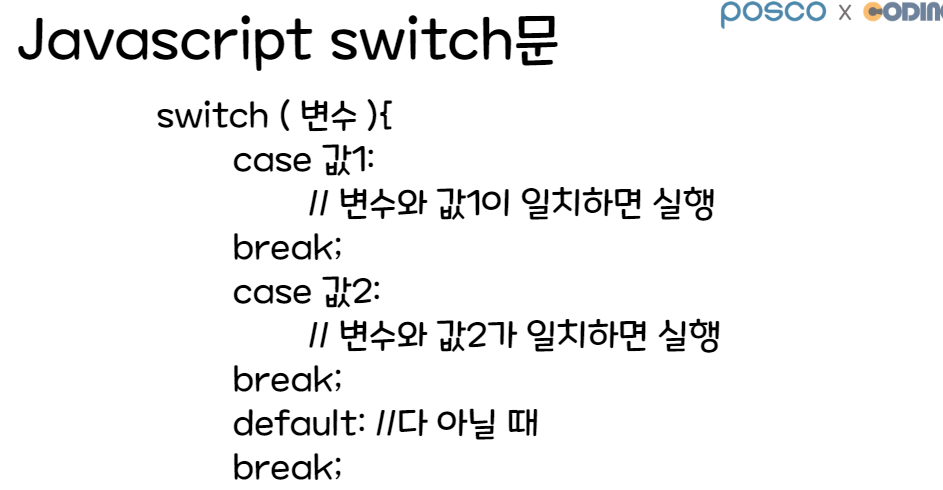
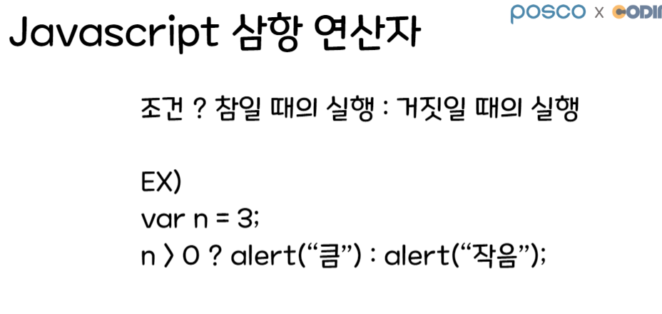
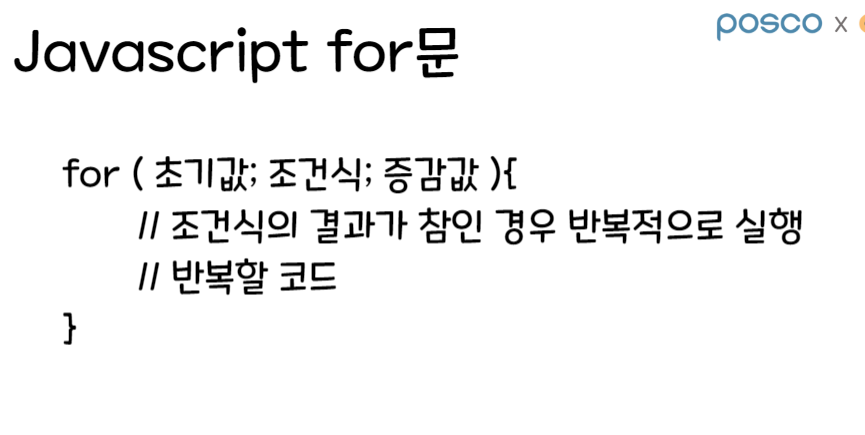
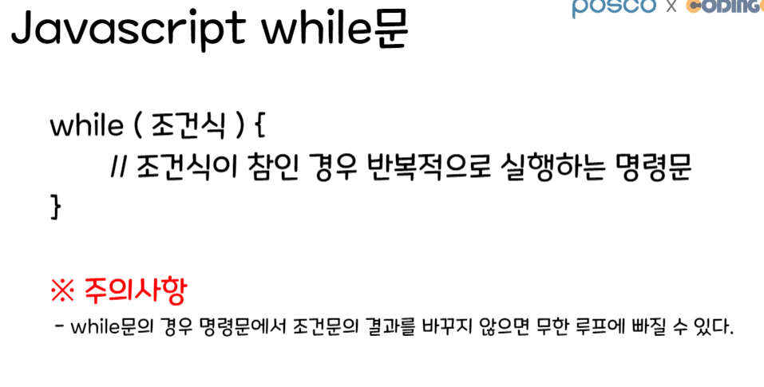

# 09/29 반복 문

Section: KDT 3rd
작성일시: 2022년 9월 29일 오전 9:22
최종 편집일시: 2022년 9월 29일 오후 12:00



- 하나 이상의 case 문으로 구성
- default 문이 있는데 필수는 아님 -> 작성 권장
- break 키워드: 블록(중괄호, {})을 빠져나갈 때 사용하는 키워드

```jsx
switch 문의 기본 구조

switch(x) {
	case 값: // if (x === 값)
		// x가 값과 같을 때 실행할 문장
		break; // x가 값과 같을 때의 문장을 실행 -> 블록을 빠져나옴
	case 값2: // if (x === 값2)
		// x가 값2와 같을 때 실행할 문장
		break; // x가 값2와 같을 때의 문장을 실행 -> 블록을 빠져나옴
	default: // else
		// x가 case에 있는 어떤 것과도 일치하지 않았을 때 실행할 문장
		break; // 블록을 빠져나옴
}
```

```jsx
let a = 6;
switch (a) {
  case 1:
  case 2:
  case 3:
    console.log("비교하려는 값보다 작습니다.");
    break;
  case 4:
    console.log("비교하려는 값과 일치합니다.");
    break;
  case 5:
  case 6:
  case 7:
  case 8:
  case 9:
    console.log("비교하려는 값보다 큽니다.");
    break;
  default:
    console.log("어떤 값인지 파악 안됨");
    break;
}
//여러개 조건문도 가능
```



- 3개의 피연산자를 필요로 함
- 조건식 ? (참일 때 실행할 코드) : (거짓일 때 실행할 코드)



```jsx
// 퀴즈) 1부터 5까지 합 구하기
let sum = 0; // 합을 저장할 변수 생성
for (let i = 1; i <= 5; i++) {
  // i: 1 2 3 4 5 6(false)
  sum = sum + i;
  // sum = 0 + 1 = 1
  // sum = 1 + 2 = 3
  // sum = 3 + 3 = 6
  // sum = 6 + 4 = 10
  // sum = 10 + 5 = 15
}
console.log(`1~10까지 모두 더한 값: ${sum}`); // 15

// 퀴즈) 1부터 10까지 짝수의 합 구하기
```

```jsx
// 퀴즈) 1부터 10까지 짝수의 합 구하기
// ver1
var sum = 0;
for (let i = 1; i <= 10; i++) {
  // i: 1 ~ 10
  if (i % 2 == 0) {
    sum = sum + i;
  }
}
console.log(`1~10까지 모두 더한 값: ${sum}`); // 30

// ver2
var sum = 0;
for (let i = 2; i <= 10; i = i + 2) {
  sum = sum + i;
  // i: 2, 4, 6, 8, 10
}
console.log(`1~10까지 모두 더한 값: ${sum}`); // 30
```



```jsx
// 퀴즈)
// case2. 9부터 4까지 while문으로 반복
n = 9; // 초기값
while (n >= 4) {
  console.log(n);
  n = n - 1;
}
console.log("반복문 끝");
```

```jsx
// Case3. 1부터 10까지 짝수 출력
// ver1
n = 1;
while (n <= 10) {
  // n: 1 ~ 10
  if (n % 2 == 0) {
    console.log(n);
  }
  n = n + 1;
}
console.log("반복문 끝");

// ver2
n = 2;
while (n <= 10) {
  // n: 2, 4, 6, 8, 10
  console.log(n);
  n = n + 2;
}
console.log("반복문 끝");

// Case4. 10부터 1까지 홀수 출력
// ver1
n = 10;
while (n >= 1) {
  // n: 10 ~ 1
  if (n % 2 === 1) {
    console.log(n);
  }
  n = n - 1;
}
console.log("반복문 끝");

// ver2
n = 9;
while (n >= 1) {
  // n: 9 7 5 3 1
  console.log(n);
  n = n - 2;
}
console.log("반복문 끝");
```
