# 09/30 객체

Section: KDT 3rd
작성일시: 2022년 9월 30일 오전 9:20
최종 편집일시: 2022년 9월 30일 오후 12:20

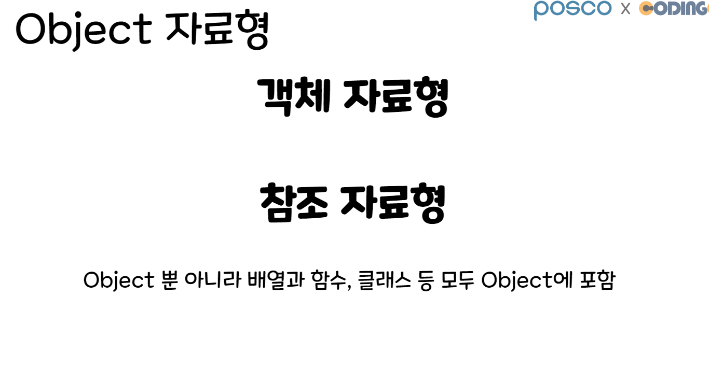

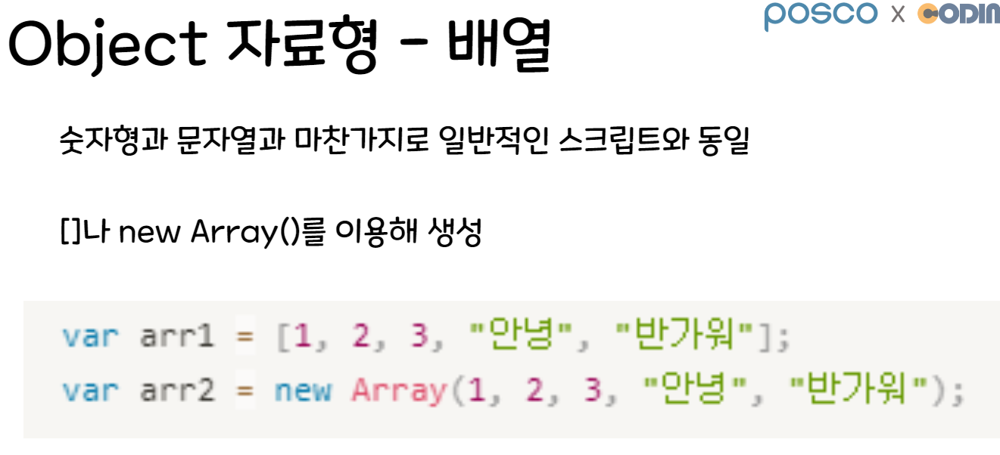

## 배열 원소(요소) 읽기

- 인덱스: 배열 원소 위치값
- 0부터 시작 주의

```jsx
console.log(arr1[0]); // 1
console.log(arr1[5]); // undefined
```

### 배열 원소값 변경

```jsx
console.log(arr1); //[1, 2, 3, "안녕", "반가워"]
arr1[2] = "따란";
console.log(arr1); //[1, 2, '따란', "안녕", "반가워"]
```

### 원소 추가

```jsx
arr1[5] = "추가";
console.log(arr1); //[1, 2, 3, "안녕", "반가워", '추가']
arr1[6] = "추추가";
console.log(arr1); //[1, 2, 3, "안녕", "반가워", '추가', '추추가']
```

### 동떨어진 인덱스 번호로 원소값 추가; 그 사이에 빈 값

```jsx
arr1[10] = "얍";
console.log(arr1);
console.log(arr1[8]); // undefined
console.log(arr1[9]); // undefined
```

### 배열에서 자주 사용되는 속성/메서드

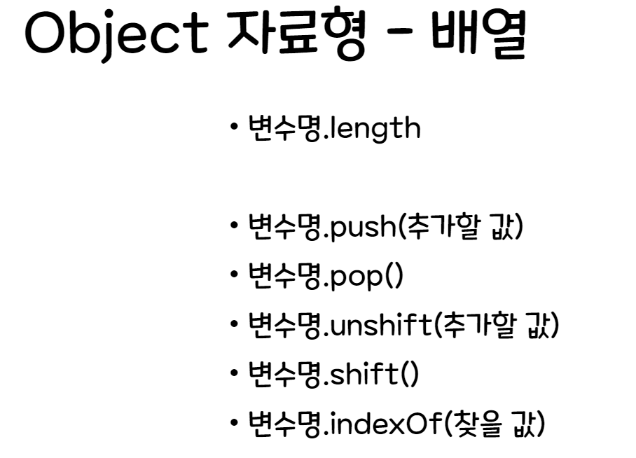

```jsx
//length : 배열 길이 = 요소 개수
console.log(arr1); //[1, 2, 3, "안녕", "반가워", '추가', '추추가']
console.log(arr2.length); //7
```

```jsx
//2. push(x): x를 맨 뒤에 추가
arr2.push(4); //[1, 2, 3, "안녕", "반가워", '추가', '추추가', 4]
arr2.push(5); //[1, 2, 3, "안녕", "반가워", '추가', '추추가', 4, 5]
arr2.push(6); //[1, 2, 3, "안녕", "반가워", '추가', '추추가', 4, 5, 6]
arr2.push(7, 8, 9); // 여러 개 추가도 가능
```

```jsx
// 3. pop(): 맨 뒤 요소를 제거
arr2.pop();
console.log(arr1); //[1, 2, 3, "안녕", "반가워", '추가', '추추가', 4, 5, 6, 7, 8,]
arr2.pop();
console.log(arr1); //[1, 2, 3, "안녕", "반가워", '추가', '추추가', 4, 5, 6, 7]
arr2.pop();
console.log(arr1); //[1, 2, 3, "안녕", "반가워", '추가', '추추가', 4, 5, 6]
```

```jsx
// 4. unshift(x): 맨 앞에 x 를 추가
arr2.unshift("hi");
console.log(arr1); //['hi', 1, 2, 3, "안녕", "반가워", '추가', '추추가', 4, 5, 6, 7, 8,]
arr2.unshift("a", "b"); // 여러 개 추가 가능
console.log(arr1); //['a', 'b', 'hi', 1, 2, 3, "안녕", "반가워", '추가', '추추가', 4, 5, 6, 7, 8,]
```

```jsx
// 6. indexOf(x): 배열 원소에 x 가 있는지 찾음
console.log(arr1.indexOf("b")); // 2
console.log(arr1.indexOf("xxxx")); // -1 : 없는 값을 찾으면 -1 반환
```

```jsx
//응용
const korean = [
  ["가", "나", "다"],
  ["라", "마", "바"],
  ["사", "아", "자"],
];

console.log(korean);
console.log(korean[0]); //['가', '나', '다']
console.log(korean[1]); //['라', '마', '바']
console.log(korean[2]); //['사', '아', '자']
console.log(korean[0][0]); //['가']
console.log(korean[1][0]); //['라']
console.log(korean[2][0]); //['사']
```

```jsx
// 3차원 배열
const nums = [
  [
    [1, 2, 3],
    [4, 5, 6],
  ],
  [
    [7, 8, 9],
    [10, 11, 12],
  ],
];

console.log(nums);
console.log(nums[1][0][1]); // 8 뽑기
```

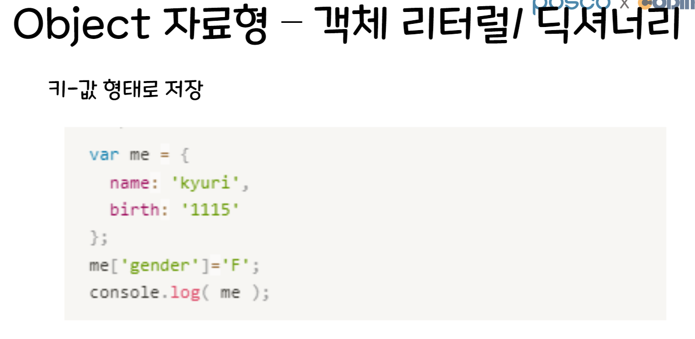

- 객체: 키-값 형태
- {}를 이용해 생성
- { key1: value1, key2: value2, key3: value3, ... }

```jsx
const cat = {
  name: "나비",
  age: 1,
  mew: function () {
    return "냐옹";
  },
};

console.log(cat);
```

### 객체 접근하기

```jsx
// 점 표기법
console.log(cat.name); //'나비'
console.log(cat.age); //1
console.log(cat.mew());
("냐옹");
```

```jsx
// value 변경하기
cat.age = 3;
console.log(cat.age); //3
```

```jsx
// key-value 추가하기
cat.gender = "f";
console.log(cat); //{name: '나비', age: 3, gender: 'f', mew: ƒ}
```

```jsx
//리터럴 안에 배열
cat.siblings = ["nana", "poo"];
console.log(cat.siblings[0]); //나
```

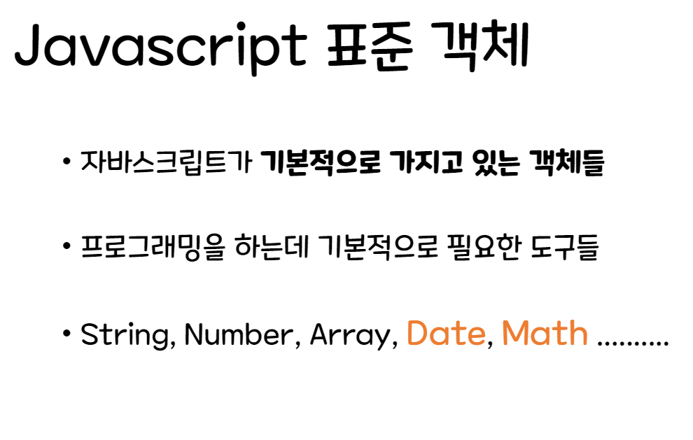

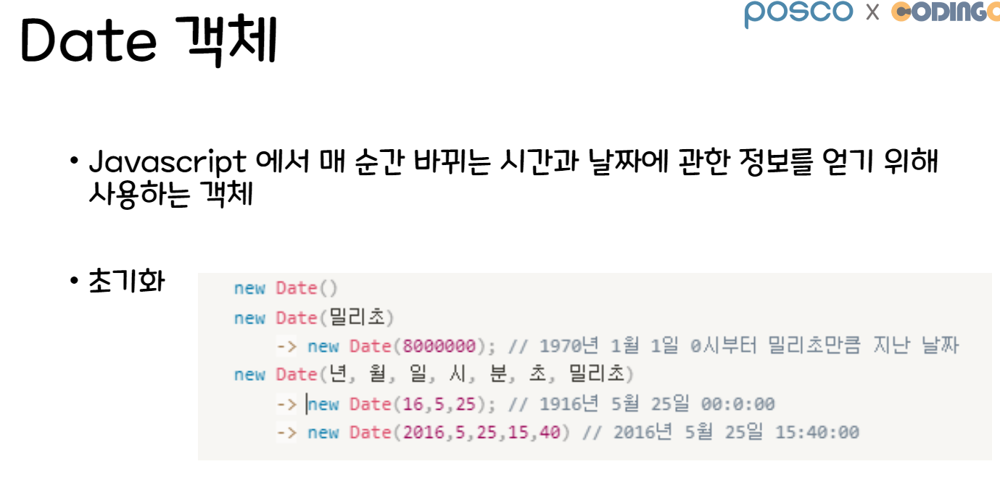

```jsx
// new Date(y, m, d, h, m, s, ms)
// year: 4자리
// month: 0(1월) ~ 11(12월) -> 주의!!
// date: 1 ~ 31 -> 생략하시면, 1으로 처리
// hour, minutes, seconds, ms
console.log(new Date(2018, 2, 2));
console.log(new Date(2018, 2, 2, 18, 20, 30));
console.log(new Date(2022, 8, 30, 10, 53));
```

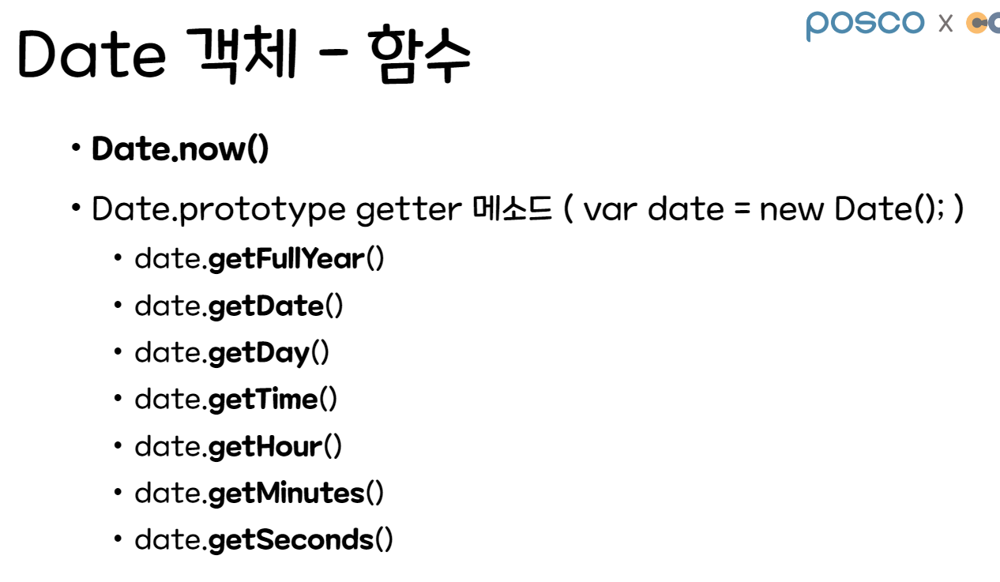

```jsx
// Date 객체 메서드
// 메서드를 이용해서 년, 월, 일 등의 값을 얻기
console.log(now);

console.log(now.getFullYear());
console.log(now.getMonth()); // 0(1월) ~ 11(12월)
console.log(now.getDate());
console.log(now.getHours());
console.log(now.getMinutes());
console.log(now.getSeconds());
console.log(now.getMilliseconds());
console.log(now.getDay()); // 요일: 0(일) ~ 6(토)
```

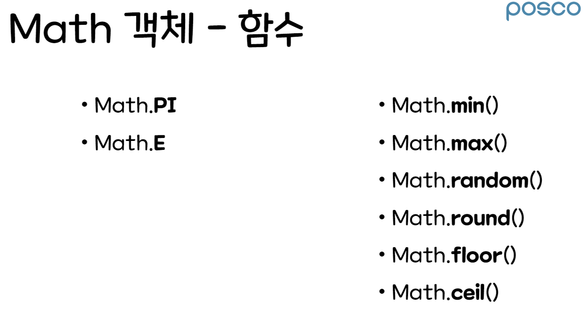

```jsx
// 속성
console.log(Math.E); // 자연로그 밑
console.log(Math.PI); // 파이
console.log(Math.SQRT2); // 2의 제곱근
```

```jsx
// 메서드
console.log(Math.min(100, 200, 30, 7)); // 최소값
console.log(Math.max(100, 200, 30, 7)); // 최대값
console.log(Math.round(6.5)); // 반올림
console.log(Math.round(6.3));
console.log(Math.floor(6.5)); // 내림
console.log(Math.floor(6.3));
console.log(Math.ceil(6.5)); // 올림
console.log(Math.ceil(6.3));
```

```jsx
// 메서드를 메서드로 감싸서도 사용 가능
console.log(Math.floor(Math.max(1.1, 2.2, 3.3, 7.7)));
console.log(Math.floor(7.7));
console.log(7);
```

```jsx
// 0 <= x < 1 범위의 난수
console.log(Math.random());

// 0 <= 10x < 10: from 0 to 9
console.log(Math.floor(Math.random() * 10));

// 퀴즈) Returns a random integer from 1 to 10:
console.log(Math.floor(Math.random() * 10) + 1);

// 퀴즈) Returns a random integer from 1 to 100:
// 1 <= Math.random() * 100 +1 < 101
console.log(Math.floor(Math.random() * 100) + 1);

// 퀴즈) Returns a random integer from 20 to 22:
// 20 <= Math.random() * 3 + 20 < 23
console.log(Math.floor(Math.random() * 3) + 20);
```

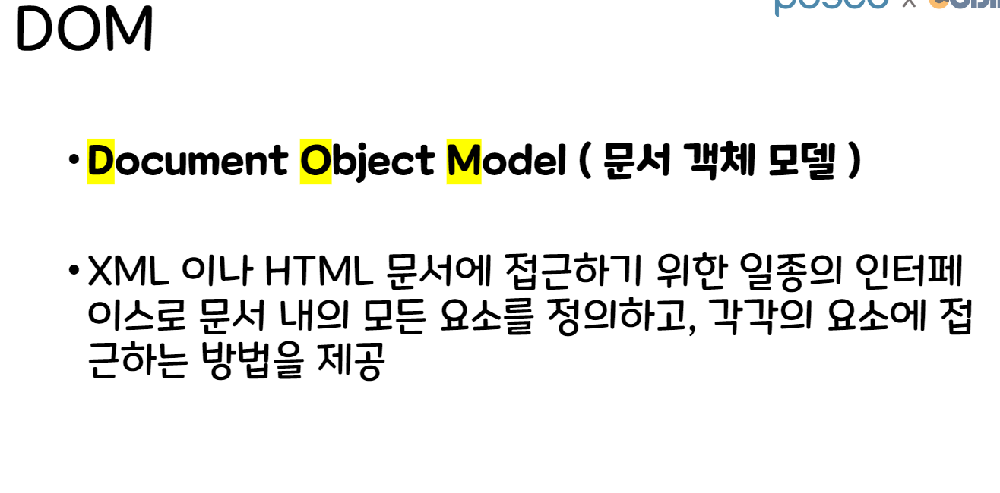

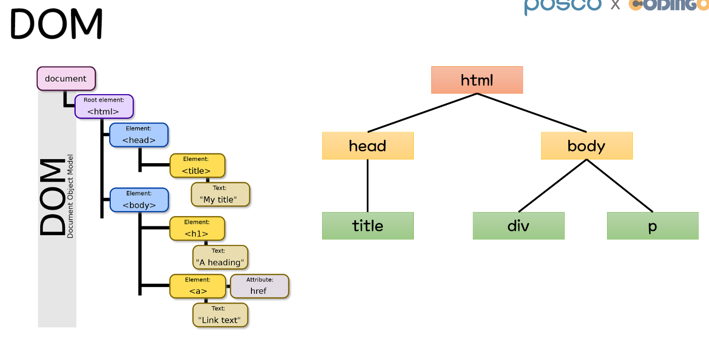


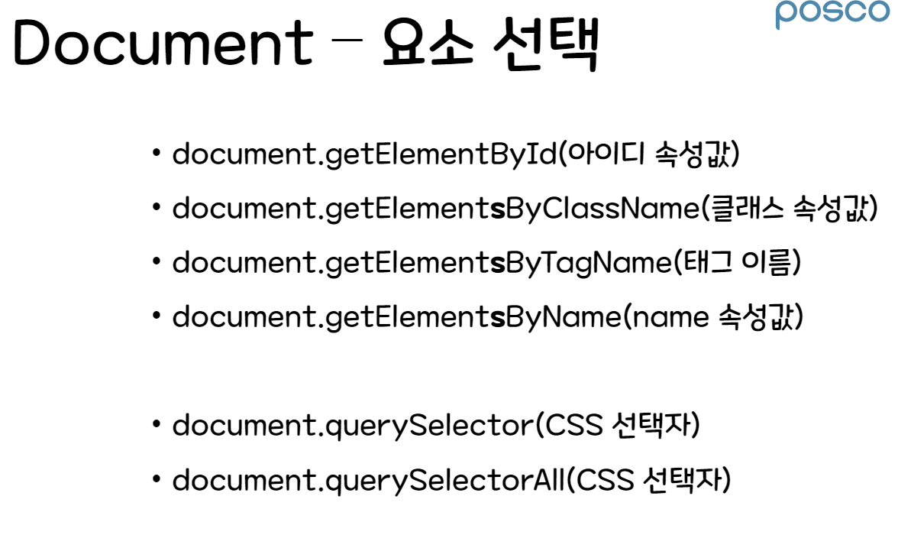

---

---

html 요소 선택하는 방법
dom 요소 선택하기 (DOM API)

```jsx
document.getElementById("something");
document.querySelector("#something");
//id 는 유일하므로 속도가 가장 빠름
```
