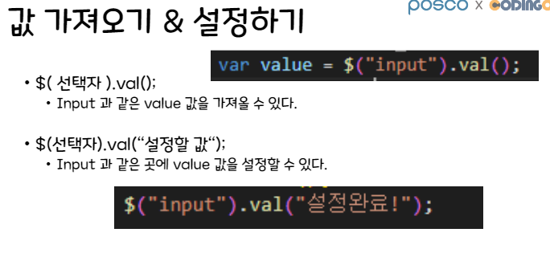

# 10/12 jQuery

Section: KDT 3rd
작성일시: 2022년 10월 12일 오전 9:49
최종 편집일시: 2022년 10월 12일 오전 11:44


# JQuery의 단점

속도가 느려진다는 점이 대표적으로 꼽힌다.

디버깅이 어렵다.

IE(Internet Explorer)가 웹 브라우저를 거의 독점할때는 절대군림 라이브러리였지만, 크롬이 등장하며 점유율이 점점 낮아지고 있다.

# 그럼에도…

그럼에도 써야하는 이유는 아직까지 시장점유율은 높다. 점차 줄어들기야 하겠지만, 아마존, 애플, MS 등 많은 기업들에서 사용중이고, 너무나 편리하기 때문에 사용법만 알고 있으면 언제나 갖다 쓸 수 있을정도로 유용하다.

모든 코드를 jQuery로 사용하기보다, 몇가지 너무 복잡한 코드들은 jQuery의 힘을 빌려보는 것도 좋을 것 같다.





```jsx
// prepend()
function prependJs() {
  let ul = document.querySelector(".colors");
  let li = document.createElement("li"); // <li></li>
  li.innerText = "첫 자식으로 추가된 js";

  ul.prepend(li);
}

function prependJquery() {
  let ul = $(".colors");
  ul.prepend("<li>첫 자식으로 추가된 jquery</li>");
}

// before()
function beforeJs() {
  let green = document.querySelector(".green");
  let li = document.createElement("li"); // <li></li>
  li.innerText = "이전 형제 요소 추가된 js";

  green.before(li);
}

function beforeJquery() {
  $(".green").before("<li>이전 형제요소로 추가된 jquery</li>");
}

// after()
function afterJs() {
  let green = document.querySelector(".green");
  let li = document.createElement("li"); // <li></li>
  li.innerText = "다음 형제 요소 추가된 js";

  green.after(li);
}

function afterJquery() {
  $(".green").after("<li>다음 형제요소로 추가된 jquery</li>");
}
```


```jsx
// remove()
function removeJs() {
  document.querySelector("#li2").remove();
}

function removeJquery() {
  $("#li2").remove();
}

// empty()
function emptyJs() {
  document.querySelector("ul.nums").innerHTML = "";
}

function emptyJquery() {
  $("ul.nums").empty();
}
```


```jsx
// 요소 탐색하기
function findParent() {
  console.log($(".child2").parent());
}

function findParents() {
  console.log($(".child2").parents());
}

function findNext() {
  console.log($(".child2").next());
}

function findPrev() {
  console.log($(".child2").prev());
}

function findChildren() {
  console.log($(".parent").children());
}
```


```jsx
// 클래스 조작하기
function addClass() {
  $("#hi").addClass("fs-50");
}

function removeClass() {
  $("#hi").removeClass("fs-50");
}

function hasClass() {
  console.log($("#hi").hasClass("fs-50"));
}

function toggleClass() {
  $("#hi").toggleClass("bg-pink");
}
```

# jQuery EventListener

```jsx
// 1. Load Event
// jquery
$(document).ready(function () {
  console.log("ready - 문서의 dom 트리가 완성되면 실행");
});

$(function () {
  console.log("안녕?");
});

// js
document.addEventListener("DOMContentLoaded", function () {
  console.log("domcontentloaded - 문서의 dom 트리가 완성되면 실행");
});

// 2. Mouse Event
$(".p-msg").click(function () {
  $(".p-msg").css("color", "red");
});

// console.log($('.num')); // length: 4
// $('.num').click(function() {
//     // $('.num').css('color', 'blue');
//     // $(this): 자기자신을 의미
//     $(this).css('color', 'blue');
//     console.log($(this)); // 클릭이 발생한 그 요소를 의미
// });

// js
const nums = document.querySelectorAll(".num");
for (let i = 0; i < nums.length; i++) {
  nums[i].addEventListener("click", function () {
    // console.log(nums[i]);
    // nums[i].style.color = 'blue';
    this.style.color = "blue";
    console.log(this);
  });
}

// mouseover(): 요소에 마우스 올렸을 때
//js
const nums = document.querySelectorAll(".num");
for (let i = 0; i < nums.length; i++) {
  nums[i].addEventListener("click", function () {
    this.style.color = "blue";
    console.log(this);
  });
}

$(".numbers").mouseover(function () {
  $(this).css("background-color", "skyblue");
  $(this).append("<div>.mouseover() called!!!</div>");
});
```
