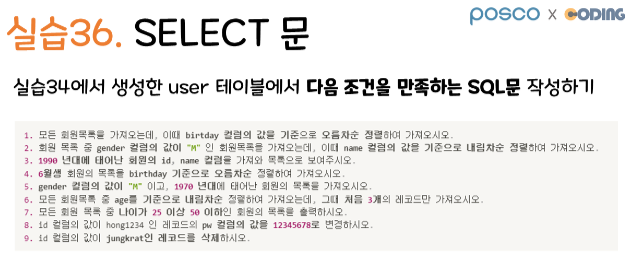

# 11/04 SQL 데이터 관리

Section: KDT 3rd
작성일시: 2022년 11월 3일 오후 3:46
최종 편집일시: 2022년 11월 4일 오후 3:43


```sql
-- [데이터베이스 관련 명령어]
-- 1. 데이터베이스 생성 (+ 한글 인코딩)
CREATE DATABASE kdt DEFAULT CHARACTER SET utf8 DEFAULT COLLATE utf8_general_ci;

-- 2. 데이터베이스 생성 확인 (목록 조회)
SHOW databases;

-- 3. 데이터베이스 사용 선언
USE kdt;

-- 4. 데이터베이스 삭제
DROP DATABASE kdt;
```


```sql
-- 제약조건
-- NOT NULL: NULL 허용 x
-- AUTO_INCREMENT: 자동 숫자 증가
-- PRIMARY KEY: 기본키!
-- DEFAULT: 기본 값
-- UNIQUE: 중복 허용 x
CREATE TABLE user (
    id INT NOT NULL AUTO_INCREMENT PRIMARY KEY,
    name VARCHAR(10) NOT NULL,
    age INT NOT NULL,
    address VARCHAR(100) NOT NULL
);
```


```sql
-- 2. 테이블 목록 확인
SHOW tables;

-- 3. 테이블 구조 확인
DESC user;

-- 4. 테이블 삭제
-- DROP: 다 삭제 (구조 자체를 삭제)
-- TRUNCATE: 초기화 (모든 행 삭제)
DROP TABLE user;
TRUNCATE TABLE user;

-- 5. 테이블 수정 (구조 수정)
-- 5-1. 칼럼 추가 (ADD)
ALTER TABLE user ADD new_column VARCHAR(10);

-- 5-2. 칼럼 수정 (MODIFY)
ALTER TABLE user MODIFY new_column INT;

-- 5-3. 칼럼 삭제 (DROP)
ALTER TABLE user DROP new_column;
```


```sql
-- [Create - INSERT]
-- : 데이터 추가
-- 참고) AUTO_INCREMENT 컬럼의 값은 넣지 않으면 알아서 증가
-- NULL 이라고 넣으면 알아서 숫자가 지정되기도 함.
-- 주의) AUTO_INCREMENT 컬럼은 반드시 PK(기본키, PRIMARY KEY)이어야 함.
INSERT INTO user (name, age, address) VALUES ('김민정', 20, '서울특별시 마포구');
```


```sql
-- [Read - SELECT]
-- 데이터 읽기(조회)
-- * : ALL
SELECT * FROM user; -- 해당 테이블의 "전체 데이터"를 조회
SELECT name FROM user; -- name 컬럼만 조회
SELECT age, name FROM user; --age, name 칼럼만 조회
SELECT id, adress FROM user; -- id, 주소 컬럼 조회
```


```sql
-WHERE절: 특정 조건을 만족하는 행(record, turple) 선택
SELECT * FROM user WHERE age >= 25; --나이가 25 이상인 사람
SELECT * FROM user WHERE id = 7; --id가 7인 사람
SELECT name FROM user WHERE id = 7; --id가 7인 사람의 이름만 조회
SELECT id, age FROM user WHERE name = '이지은'; --이름이 '이지은'인 사람의 id와 age를 조회
```


```sql
-- BETWEEN a AND b: 사이값 조회
SELECT * FROM user WHERE age BETWEEN 25 AND 30;

-- IN (list): 리스트 있는 것 중에 일치하면 참
SELECT * FROM user WHERE age IN (20, 21, 22, 23);

-- LIKE: 패턴 조회
-- %: 0개 이상의 문자
-- _: 1개의 단일 문자
SELECT * FROM user WHERE address LIKE '서울%'; -- '서울'로 시작하는 주소인 데이터
SELECT * FROM user WHERE name LIKE '__희'; -- 이름의 마지막 글자가 '희'인 데이터
-- 질문) 구문에서 이름이 4글자이거나 2글자인 사람은 제외되는 건가요? 네!
SELECT * FROM user WHERE name LIKE '%희%'; -- 이름에 '희'가 있는 데이터
SELECT * FROM user WHERE address LIKE '%광역%'; -- 주소에 '광역'이 포함된 데이터
SELECT * FROM user WHERE name LIKE '__희' ORDER BY age DESC;
-- 이름의 마지막 글자가 '희'인 사람들 나이 기준으로 내림차순

-- IS NULL
-- IS NOT NULL
INSERT INTO user (name, age) VALUES ('서현승', 28);
SELECT * FROM user;

SELECT * FROM user WHERE address IS NULL;
SELECT * FROM user WHERE address IS NOT NULL;

-- ORDER BY절: 데이터 정렬
-- ASC: 오름차순 (기본값)
-- DESC: 내림차순
SELECT * FROM user ORDER BY age DESC; -- age 컬럼 내림차순
SELECT * FROM user WHERE id > 6 ORDER BY age ASC; -- id 6초과인 사람 중에서 age 컬럼 오름차순
SELECT * FROM user ORDER BY name ASC; -- name 컬럼 오름차순 정렬 (가나다순)
```


```sql
- 논리연산자: AND, OR, NOT
SELECT * FROM user WHERE address IS NOT NULL AND age < 25;
SELECT * FROM user WHERE address IS NOT NULL OR age < 25;
SELECT * FROM user WHERE name LIKE '이%' and age = 23; -- 이씨이자 23세인 사람
```


```sql
-- [Update - UPDATE]
-- : 데이터 갱신(수정)
-- 참고) Error Code: 1175.
-- 테이블 데이터를 update/delete하려고 할 때 key 컬럼을 이용해서 수정/삭제하는 것이 바람직
UPDATE user SET address = '서울특별시 강북구' WHERE id = 1;
UPDATE user SET address = '제주특별자치도 제주시', name = '이지현' WHERE id = 2;

-- 주의) update where절 미사용시, 모든 행의 데이터가 변경됨
-- update에서는 where절이 항상 따라다님
```

```sql
-- [Delete - DELETE]
-- 데이터 삭제
-- 주의) delete where절 미사용시, 모든 행의 데이터가 삭제됨
-- delete에서는 where절이 항상 따라다님
DELETE FROM user WHERE id = 11;
DELETE FROM user WHERE id > 8; -- 9이상 id값을 가진 데이터가 삭제 됨.
```



```sql
1. SELECT * FROM user ORDER BY birthday ASC;
2. SELECT * FROM user WHERE gender = 'M' ORDER BY gender DESC;
3. SELECT * FROM user WHERE birthday BETWEEN '1990-00-00' AND '2000-00-00';
4. SELECT * FROM user WHERE birthday LIKE '%-06-%' ORDER BY birthday ASC;
5. SELECT * FROM user WHERE gender = 'M' AND birthday BETWEEN '1970-00-00' AND '1980-00-00';
6. SELECT * FROM user ORDER BY age DESC LIMIT 3;
7. SELECT * FROM user WHERE age BETWEEN 25 AND 50;
8. UPDATE user SET pw = 12345678 WHERE id = 'hong1234';
9. DELETE FROM user WHERE id = 'jungkrat';
```

## 데이터 베이스 심화

```sql
-- [PK-FK 연결하기]
-- 1. 기본 키 제약조건
-- : 고객 테이블에 기본키를 설정함

-- 고객(customer) 테이블 생성
CREATE TABLE customer (
    id VARCHAR(10) NOT NULL PRIMARY KEY,
    name VARCHAR(10) NOT NULL,
    birthday DATE NOT NULL
);
DESC customer;

-- 고객(customer) 테이블 데이터 추가
INSERT INTO customer (id, name, birthday) VALUES ('aaa', '김이현', '1990-03-17');
INSERT INTO customer (id, name, birthday) VALUES ('bbb', '최지율', '1992-11-01');
INSERT INTO customer (id, name, birthday) VALUES ('ccc', '이혜진', '1993-05-31');

-- 고객(customer) 테이블 정보 확인
SELECT * FROM customer;

-- #################################################
-- 2. 외래키 제약조건
-- : 두 테이블 사이의 관계를 만들어줌
-- 다른 테이블의 기본키(PK)를 현재 테이블의 외래키(FK)로 연결함
-- 기준 테이블: 기본키 갖는 테이블
-- 참조 테이블: 외래키가 있는 테이블
-- 형식: FOREIGN KEY(열_이름) REFERENCES 기준_테이블(열_이름)

-- ON UPDATE CASCADE: 기준 테이블의 데이터가 변경되면 참조 테이블의 데이터도 변경됨
-- ON DELETE CASCADE: 기준 테이블의 데이터가 삭제되면 참조 테이블의 데이터도 삭제됨

-- 주문목록(orderlist) 테이블 생성
DROP TABLE orderlist;
CREATE TABLE orderlist (
    id INT AUTO_INCREMENT NOT NULL PRIMARY KEY,
    customer_id VARCHAR(20) NOT NULL,
    product_name VARCHAR(20) NOT NULL,
    quantity INT,
    FOREIGN KEY(customer_id) REFERENCES customer(id) ON UPDATE CASCADE ON DELETE CASCADE
);
DESC orderlist;

-- 고객(Orderlist) 테이블 데이터 추가
INSERT INTO orderlist (customer_id, product_name, quantity) VALUES ('aaa', '맥북m1', 1);
INSERT INTO orderlist (customer_id, product_name, quantity) VALUES ('bbb', '빅파이', 31);
INSERT INTO orderlist (customer_id, product_name, quantity) VALUES ('ccc', '키보드', 3);
INSERT INTO orderlist (customer_id, product_name, quantity) VALUES ('bbb', '초코파이', 5);
INSERT INTO orderlist (customer_id, product_name, quantity) VALUES ('ccc', '귀여운텀블러', 1);

-- 고객(Orderlist) 테이블 정보 확인
SELECT * FROM orderlist;

-- #################################################
-- [JOIN, 조인]
-- : 두 테이블을 묶어서 하나의 테이블을 만듦
-- 두 테이블을 엮어서 원하는 형태를 보고 싶을 때
-- ex.
-- customer(id, name, birthday) / orderlist(id, customer_id, product_name, quantity)
-- 하나의 큰 테이블(customer_id, product_name, quantity, name, birthday)

-- *일대다 관계 (one to many)
-- (1) A 테이블에는 하나의 값만 존재
-- (2) B 테이블에는 여러 개의 값이 존재
-- ex. 한 회원(A)은 여러 개의 주문(B) 정보를 가질 수 있음
--      => 즉, 회원은 한 명(one) 이지만 구매를 여러 번 (many) 가능

/*
SELECT 열_목록
FROM tableA
    INNER JOIN tableB
    ON 조인_조건
[WHERE 검색_조건]
*/

SELECT * FROM customer;
SELECT * FROM orderlist;

-- 유저아이디를 기준으로 customer와 orderlist 조인 (모든 컬럼에 대해 모든 행 보기)
SELECT *
FROM customer
    INNER JOIN orderlist
    ON customer.id = orderlist.customer_id;

-- 유저아이디를 기준으로 customer와 orderlist 조인 (모든 컬럼에 대해 where절 만족하는 행만 보기)
SELECT *
FROM customer
    INNER JOIN orderlist
    ON customer.id = orderlist.customer_id
WHERE quantity >= 5;

-- 유저아이디를 기준으로 customer와 orderlist 조인 (일부 컬럼에 대해 모든 행 보기)
SELECT customer.id, customer.name, orderlist.product_name, orderlist.quantity
FROM customer
    INNER JOIN orderlist
    ON customer.id = orderlist.customer_id;

-- 유저아이디를 기준으로 customer와 orderlist 조인 (일부 컬럼 이름에 별명을 붙여 모든 행 보기)
SELECT orderlist.id as order_id, customer.id as user_id, orderlist.product_name, orderlist.quantity
FROM customer
    INNER JOIN orderlist
    ON customer.id = orderlist.customer_id;

-- 유저아이디를 기준으로 customer와 orderlist 조인 (일부 컬럼 이름에 별명을 붙여 조건을 만족하는 행 보기)
SELECT orderlist.id as order_id, customer.id as user_id, orderlist.product_name, orderlist.quantity
FROM customer
    INNER JOIN orderlist
    ON customer.id = orderlist.customer_id
WHERE orderlist.id = 3;

SELECT orderlist.id as customer.id, order_id as user_id, orderlist.product_name, orderlist.quantity
FROM customer
    INNER JOIN orderlist
    ON customer.id = orderlist.customer_id
WHERE orderlist.id = 3;
```
