# 11/04 SQL 데이터 관리

Section: KDT 3rd
작성일시: 2022년 11월 3일 오후 3:46
최종 편집일시: 2022년 11월 4일 오후 12:15


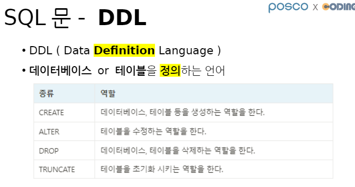

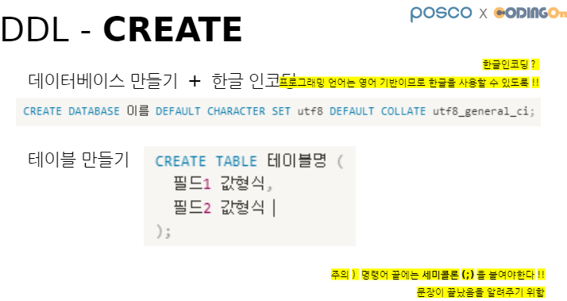

```sql
-- [데이터베이스 관련 명령어]
-- 1. 데이터베이스 생성 (+ 한글 인코딩)
CREATE DATABASE kdt DEFAULT CHARACTER SET utf8 DEFAULT COLLATE utf8_general_ci;

-- 2. 데이터베이스 생성 확인 (목록 조회)
SHOW databases;

-- 3. 데이터베이스 사용 선언
USE kdt;

-- 4. 데이터베이스 삭제
DROP DATABASE kdt;
```

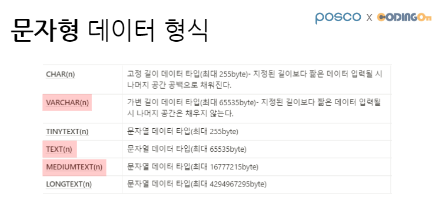

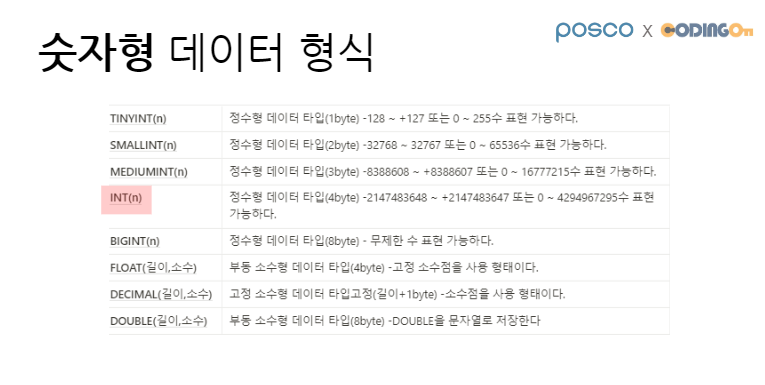

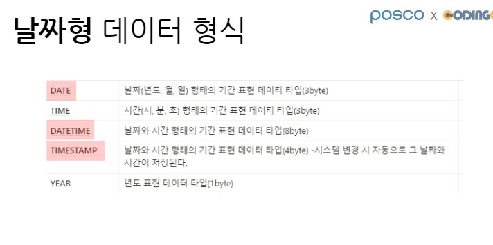

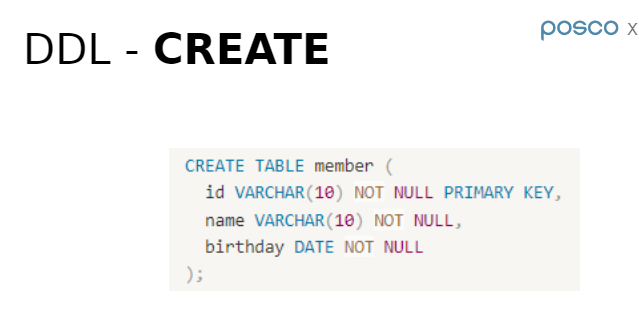

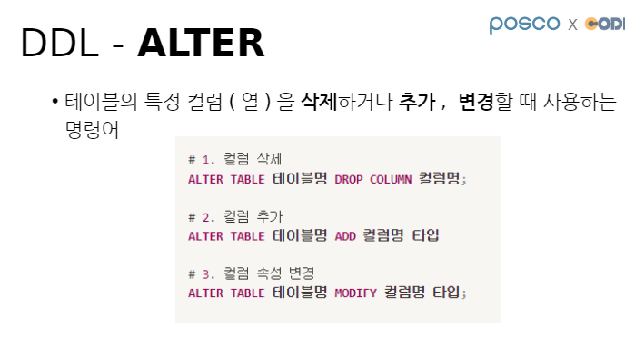

```sql
-- 제약조건
-- NOT NULL: NULL 허용 x
-- AUTO_INCREMENT: 자동 숫자 증가
-- PRIMARY KEY: 기본키!
-- DEFAULT: 기본 값
-- UNIQUE: 중복 허용 x
CREATE TABLE user (
    id INT NOT NULL AUTO_INCREMENT PRIMARY KEY,
    name VARCHAR(10) NOT NULL,
    age INT NOT NULL,
    address VARCHAR(100) NOT NULL
);
```

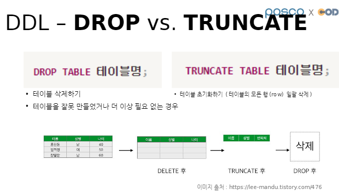

```sql
-- 2. 테이블 목록 확인
SHOW tables;

-- 3. 테이블 구조 확인
DESC user;

-- 4. 테이블 삭제
-- DROP: 다 삭제 (구조 자체를 삭제)
-- TRUNCATE: 초기화 (모든 행 삭제)
DROP TABLE user;
TRUNCATE TABLE user;

-- 5. 테이블 수정 (구조 수정)
-- 5-1. 칼럼 추가 (ADD)
ALTER TABLE user ADD new_column VARCHAR(10);

-- 5-2. 칼럼 수정 (MODIFY)
ALTER TABLE user MODIFY new_column INT;

-- 5-3. 칼럼 삭제 (DROP)
ALTER TABLE user DROP new_column;
```

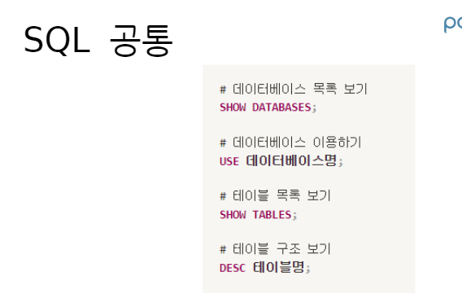

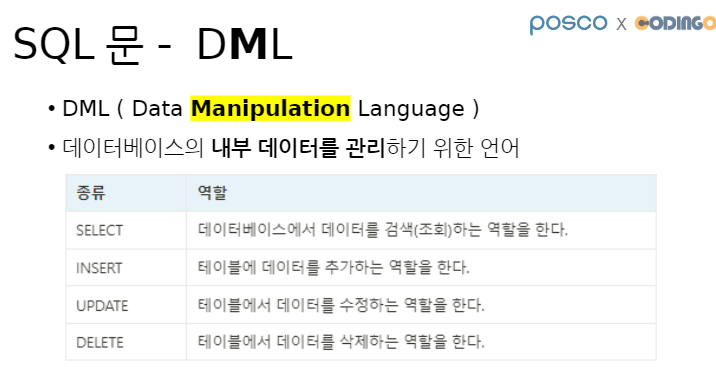

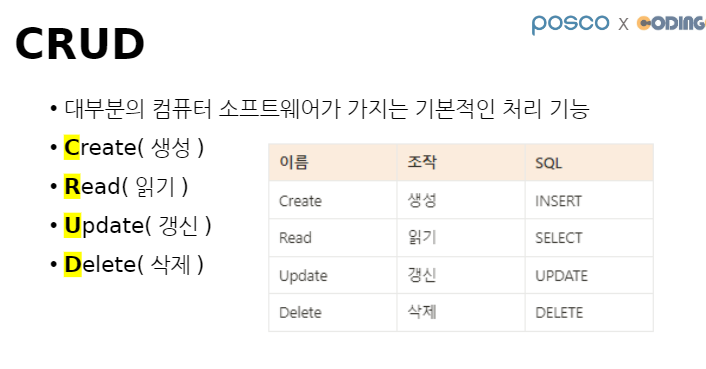

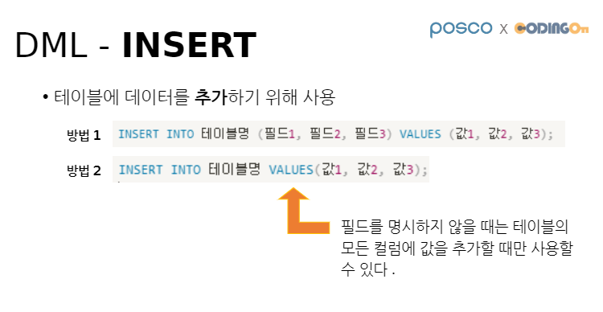

```sql
-- [Create - INSERT]
-- : 데이터 추가
-- 참고) AUTO_INCREMENT 컬럼의 값은 넣지 않으면 알아서 증가
-- NULL 이라고 넣으면 알아서 숫자가 지정되기도 함.
-- 주의) AUTO_INCREMENT 컬럼은 반드시 PK(기본키, PRIMARY KEY)이어야 함.
INSERT INTO user (name, age, address) VALUES ('김민정', 20, '서울특별시 마포구');
```

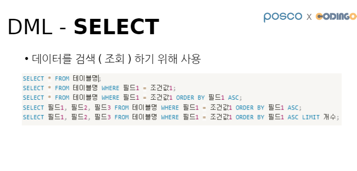

```sql
-- [Read - SELECT]
-- 데이터 읽기(조회)
-- * : ALL
SELECT * FROM user; -- 해당 테이블의 "전체 데이터"를 조회
SELECT name FROM user; -- name 컬럼만 조회
SELECT age, name FROM user; --age, name 칼럼만 조회
SELECT id, adress FROM user; -- id, 주소 컬럼 조회
```

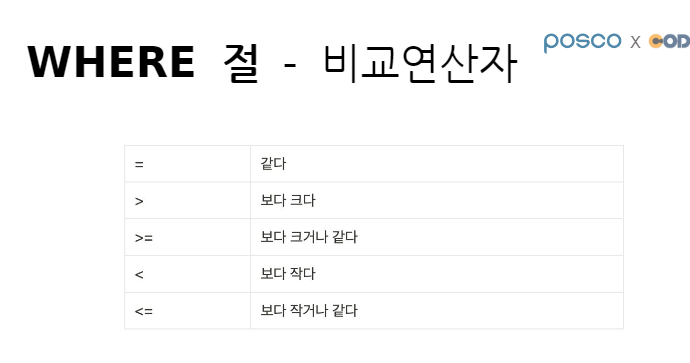

```sql
-WHERE절: 특정 조건을 만족하는 행(record, turple) 선택
SELECT * FROM user WHERE age >= 25; --나이가 25 이상인 사람
SELECT * FROM user WHERE id = 7; --id가 7인 사람
SELECT name FROM user WHERE id = 7; --id가 7인 사람의 이름만 조회
SELECT id, age FROM user WHERE name = '이지은'; --이름이 '이지은'인 사람의 id와 age를 조회
```

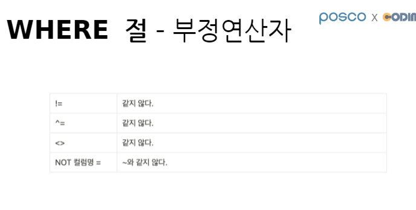

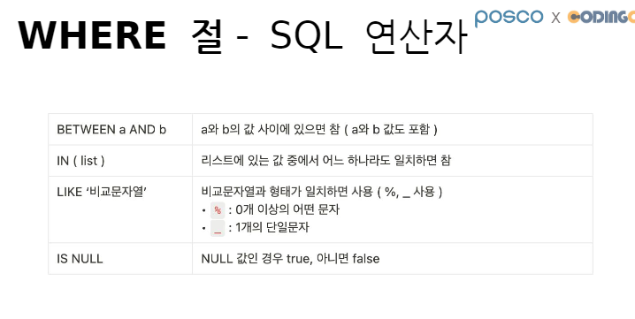

```sql
-- BETWEEN a AND b: 사이값 조회
SELECT * FROM user WHERE age BETWEEN 25 AND 30;

-- IN (list): 리스트 있는 것 중에 일치하면 참
SELECT * FROM user WHERE age IN (20, 21, 22, 23);

-- IS NULL
-- IS NOT NULL
INSERT INTO user (name, age) VALUES ('서현승', 28);
SELECT * FROM user;

SELECT * FROM user WHERE address IS NULL;
SELECT * FROM user WHERE address IS NOT NULL;
```

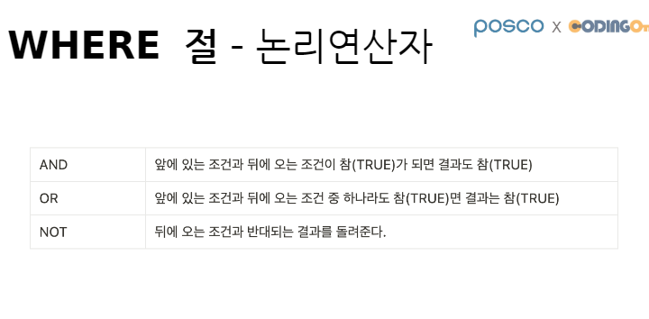

```sql
- 논리연산자: AND, OR, NOT
SELECT * FROM user WHERE address IS NOT NULL AND age < 25;
SELECT * FROM user WHERE address IS NOT NULL OR age < 25;
SELECT * FROM user WHERE name LIKE '이%' and age = 23; -- 이씨이자 23세인 사람
```


```sql
-- [Update - UPDATE]
-- : 데이터 갱신(수정)
-- 참고) Error Code: 1175.
-- 테이블 데이터를 update/delete하려고 할 때 key 컬럼을 이용해서 수정/삭제하는 것이 바람직
UPDATE user SET address = '서울특별시 강북구' WHERE id = 1;
UPDATE user SET address = '제주특별자치도 제주시', name = '이지현' WHERE id = 2;

-- 주의) update where절 미사용시, 모든 행의 데이터가 변경됨
-- update에서는 where절이 항상 따라다님
```

```sql
-- [Delete - DELETE]
-- 데이터 삭제
-- 주의) delete where절 미사용시, 모든 행의 데이터가 삭제됨
-- delete에서는 where절이 항상 따라다님
DELETE FROM user WHERE id = 11;
DELETE FROM user WHERE id > 8; -- 9이상 id값을 가진 데이터가 삭제 됨.
```
