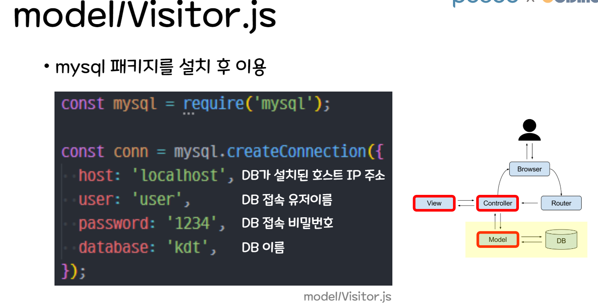

# 11/08 MVC MYSQL

Section: KDT 3rd
작성일시: 2022년 11월 8일 오후 3:47
최종 편집일시: 2022년 11월 8일 오후 3:54





```jsx
const mysql = require("mysql");

// DB 연결 정보
const conn = mysql.createConnection({
  host: "localhost",
  user: "user",
  password: "1234",
  database: "kdt",
});

exports.getVisitors = (callback) => {
  // before
  // return [
  //   { id: 1, name: '홍길동', comment: '내가 왔다.' },
  //   { id: 2, name: '이찬혁', comment: '으라차차' },
  // ];

  // after - mysql 연결
  // query(SQL, callback)
  conn.query("SELECT * FROM visitor", (err, rows) => {
    if (err) {
      throw err;
    }

    console.log("Visitor.js", rows);
    callback(rows);
  });
};

exports.postVisitor = (data, callback) => {
  conn.query(
    `INSERT INTO visitor (name,comment) VALUES('${data.name}','${data.comment}')`,
    (err, rows) => {
      if (err) {
        throw err;
      }

      console.log("Visitor.js", rows);
      callback(rows.insertId);
    }
  );
};

exports.deleteVisitor = (id, callback) => {
  // id: 사용자가 삭제버튼을 클릭한 그 행의 id 값
  console.log("id: ", id);
  conn.query(`DELETE FROM visitor WHERE id =${id};`, (err, rows) => {
    if (err) {
      throw err;
    }
    console.log("Visitor.js: ", rows);
    callback(true); //true: 삭제 성공을 의미;
  });
};
```


```sql
-- MySQL 사용자 추가하기
CREATE USER 'user'@'%' IDENTIFIED BY '비밀번호';
-- user 계정에 DB 권한 부여 (모든 DB에 접근 가능하도록)
GRANT ALL PRIVILEGES ON *.* TO 'user'@'%' WITH GRANT OPTION;
-- 현재 사용중인 MySQL 캐시를 지우고 새로운 설정 적용
FLUSH PRIVILEGES;

-- MySQL 비번 확정/변경
ALTER USER 'user'@'%' IDENTIFIED WITH mysql_native_password BY '비밀번호';
```


```jsx
const Visitor = require("../model/Visitor");

exports.main = (req, res) => {
  res.render("index");
};

exports.getVisitors = (req, res) => {
  // before
  // console.log(Visitor.getVisitors());
  // res.render('visitor', { data: Visitor.getVisitors() });

  // after
  Visitor.getVisitors((result) => {
    console.log("Cvisitor.js", result); // [ {}, {}, {}, {} ]
    res.render("visitor", { data: result });
  });
};

exports.postVisitor = (req, res) => {
  console.log(req.body);

  Visitor.postVisitor(req.body, (result) => {
    console.log("Cvisitor.js", result);
    res.send({
      id: result,
      name: req.body.name,
      comment: req.body.comment,
    });
  });
};

exports.deleteVisitor = (req, res) => {
  console.log(req.body);
  console.log(req.body.id);

  Visitor.deleteVisitor(req.body.id, (result) => {
    console.log("Cvisitor.js: ", result);
    res.send("삭제 성공!!!");
  });
};
```


