# 11/15 Socket

Section: KDT 3rd
작성일시: 2022년 11월 15일 오후 4:50
최종 편집일시: 2022년 11월 15일 오후 6:05

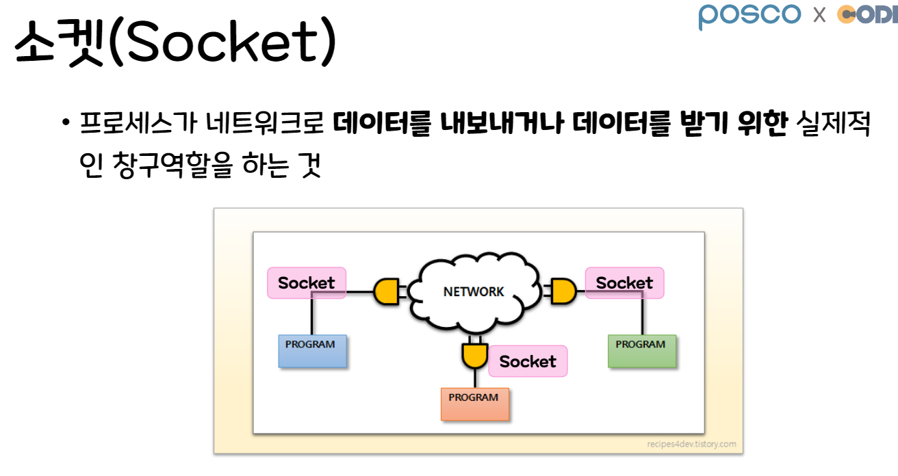

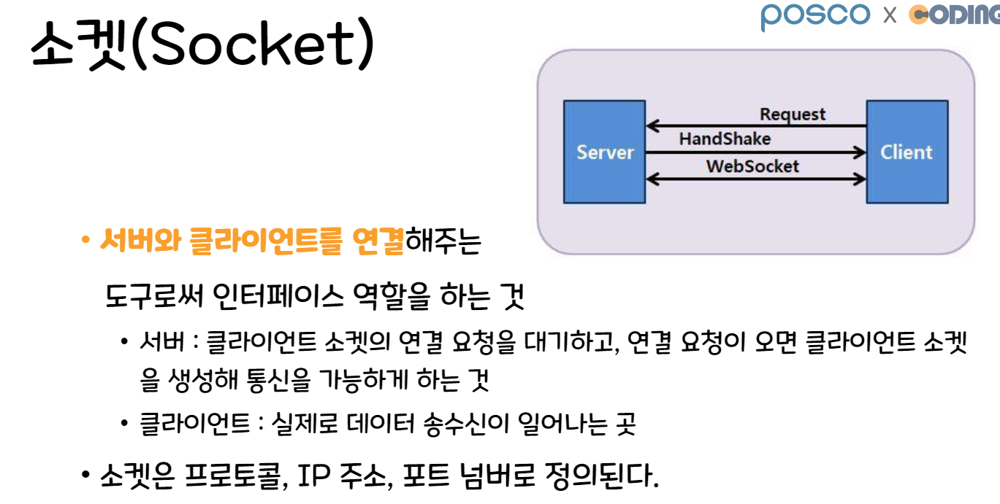

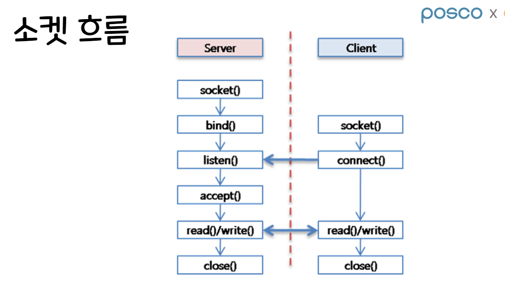

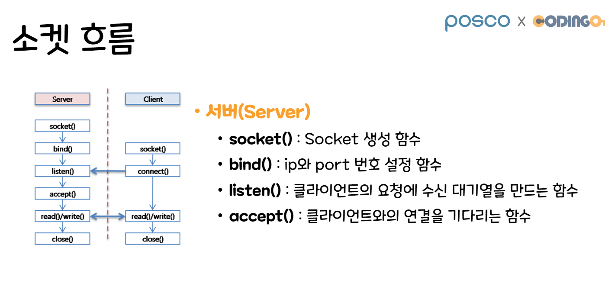

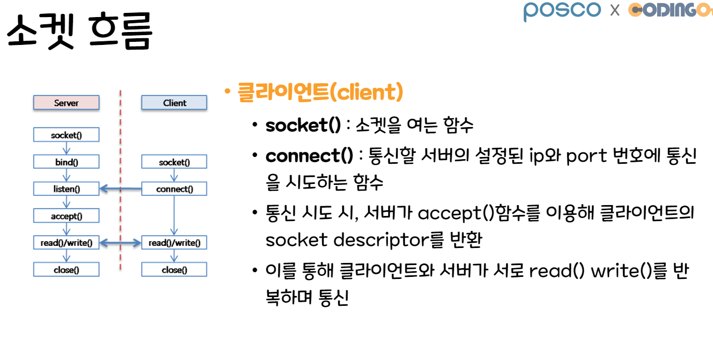

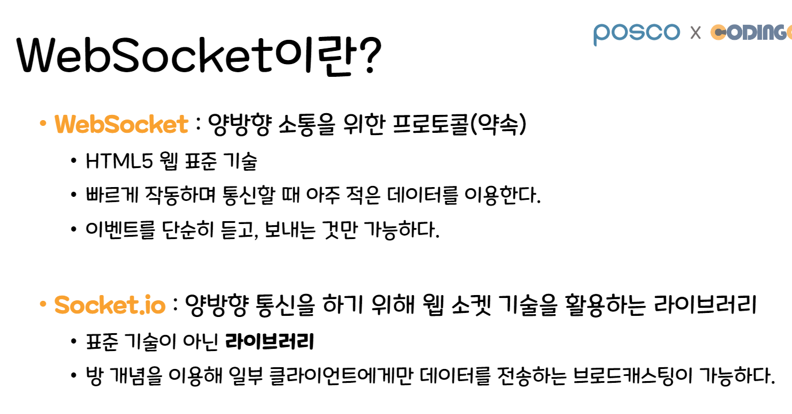

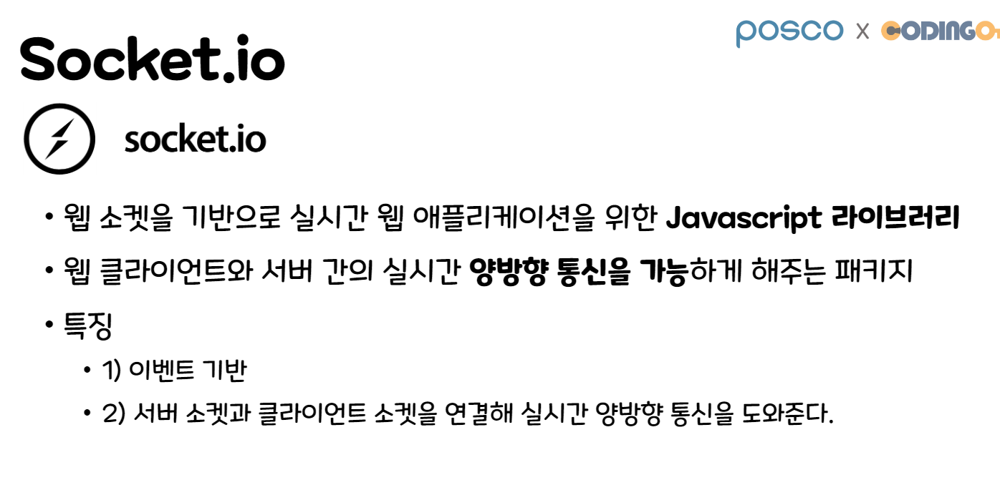

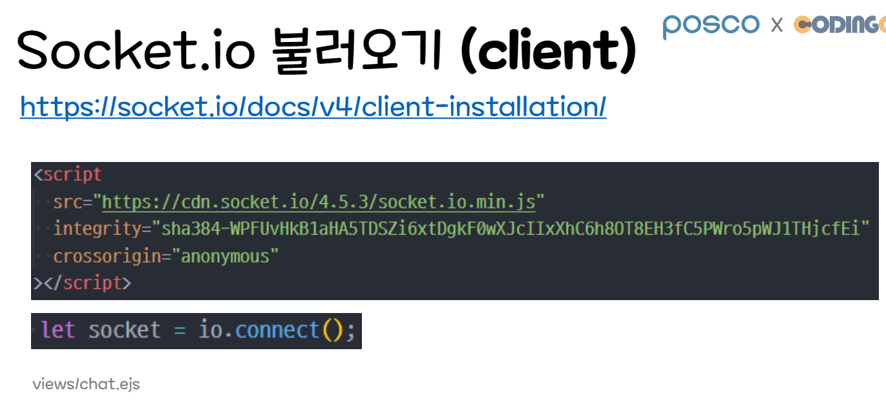

## socket.ejs

```jsx
let socket = io.connect(); // socket 사용을 위한 객체 생성

socket.on("connect", () => {
  console.log("**** ⭕ Client Socket Connected >>", socket.id);
});
//**** ⭕ Client Socket Connected >> BumTz8BfCOHUH-SEAAAB
//socket 고유 아이디 확인가능
```

# EVENT

## socket.event

```jsx
// 해당 이벤트를 받고 콜백함수를 실행
socket.on("받을 이벤트 명", (msg) => {});
// 이벤트 명을 지정하고 메세지를 보낸다.
socket.emit("전송할 이벤트 명", msg);

// 클라이언트에서 지정한 이벤트가 emit되면 수신 발생
socket.on("event_name", (data) => {});
```

## io.event

```jsx
// 접속된 모든 클라이언트에게 메시지를 전송한다
io.emit("event_name", msg);

// 메시지를 전송한 클라이언트에게만 메시지를 전송한다
socket.emit("event_name", msg);

// 메시지를 전송한 클라이언트를 제외한 모든 클라이언트에게 메시지를 전송한다
socket.broadcast.emit("event_name", msg);

// 특정 클라이언트에게만 메시지를 전송한다
io.to(id).emit("event_name", data);

// 클라이언트와 소켓IO 연결됬는지 안됬는지 이벤트 실행. (채팅방에 누가 입장하였습니다/퇴장하였습니다 )
io.on("connection/disconnection", (socket) => {});
```

# **Socket.IO의 핵심은 socket 객체와 io 객체이다.**

`socket.request` 속성으로 요청 객체에 접근할 수 있고, `socket.request.res` 로는 응답 객체에 접근할 수 있다.

**`socket.id`**로 **소켓 고유의 아이디**도 가져올 수 있으며 이 아이디로 **소켓의 주인을 특정**할 수 있다. (특정 채팅방 참여자에게 귓속말을 보낸다거나 강퇴시킨다거나)

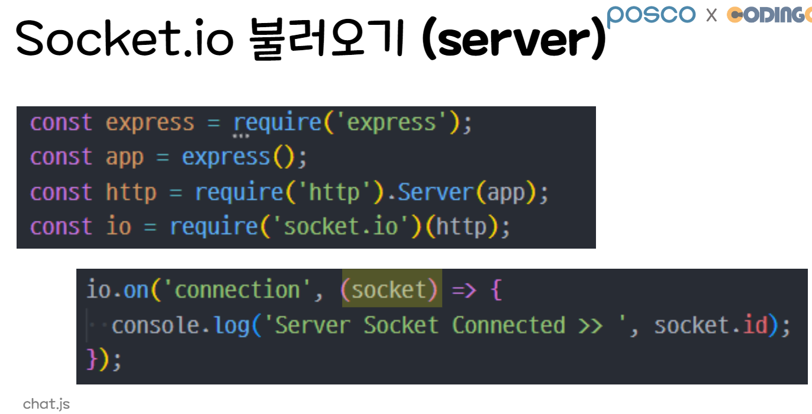

## chat.js

```jsx
const express = require("express");
const app = express();
// socket은 express가 아닌 http 모듈에 연결해야 사용 가능
const http = require("http").Server(app);
const io = require("socket.io")(http); // http-socket 연결
const PORT = 8000;

app.set("view engine", "ejs");
app.use("/views", express.static("/views"));

app.get("/", (req, res) => {
  res.render("chat");
});

// io.on
// : socket과 관련된 통신작업을 처리
io.on("connection", (socket) => {
  // "connection" event
  // : 클라이언트가 접속했을 때 발생, 콜백으로 socket 객체를 제공!

  console.log("**** ⭕ Server Socket Connected >> ", socket.id);
  // socket.id: 소켓 고유 아이디 -> socket은 웹 페이지 별로 생김!!
});

// 주의!!!) 소켓을 사용하기 위해서는 http.listen()으로 포트를 열어야 함
http.listen(PORT, () => {
  console.log(`http://localhost:${PORT}`);
});
```

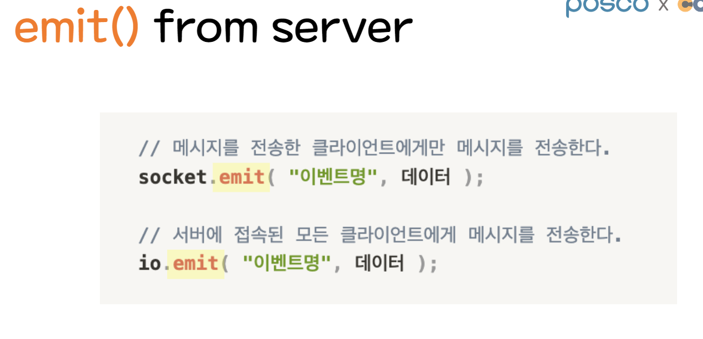

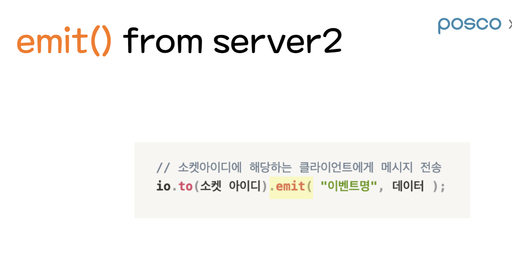
